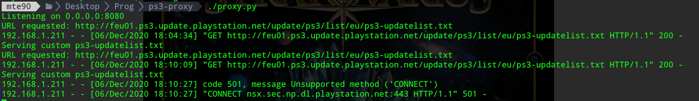

# PS3 Proxy for custom firmware version

As today there is a new PS3 firmware (and I have a previous firmware) but I want to be able to activate the Playstation without use Windows tools (as I am on Linux) and without waiting for a new modded firmware version.  

So in an hour I did this simple proxy that let you specify the firmware version that you have and automatically will proxy all the other requests to the original pages.  
Except the request to `ps3-updatelist.txt` that will use a custom file (available in the repo) that include a version placeholder.

## How to use it

Open the `proxy.py` file and change the version that you want in the code.  
Run in your shell (give execution permission):  

`./proxy.py`

Now on PS3 you need to configure in Network Settings your computer as proxy, if you are a Linux user I don't need you to explain how to see that (`ifconfig`) and use that in the PS3.  
During the procedure for activate the connection will asks you to verify the connection, I don't know why it fails but you can ignore that and open the PSN app in the PS3 as the tool will works without problems.

This is a screenshot of the output of the real activation with account registering of my PS3:

### Requirements

* Python 3

## My discoveries

To avoid issues I did that the proxy will copy the original request headers but it wasn't working yet. There was still issues on PS side with my custom request.  

So I tried the way to have the same file with the same content except the version and it was different for few bytes. The issue was the carriage return that on Linux is automatically removed when you manipulate files but seems that without that the PS3 cannot parse right that file.
